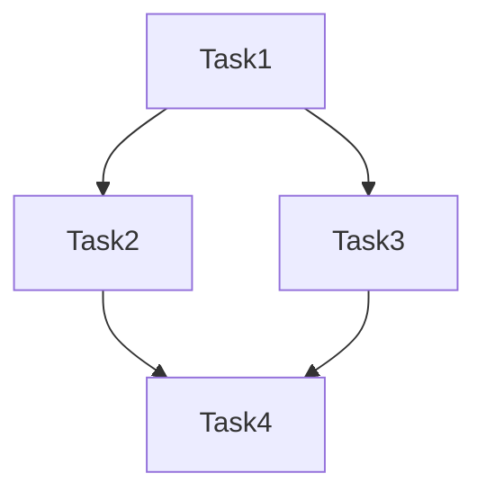

# 调度系统分析器

分析复杂调度系统的代码结构，提取业务逻辑和数据流信息，生成系统知识文档。

## 分析流程

执行以下步骤完成调度系统分析：

### 步骤1: 识别调度框架类型

扫描代码库，确定使用的调度框架：

- **Quartz**: 查找 `Job`, `JobDetail`, `Trigger`, `Scheduler` 类
- **Spring Scheduler**: 查找 `@Scheduled`, `@EnableScheduling` 注解
- **Spring Batch**: 查找 `Job`, `Step`, `ItemReader`, `ItemWriter`, `ItemProcessor`
- **自研框架**: 查找自定义的调度接口（如 `*JobExecutor`, `*Task`）

**识别方法**:
```bash
# 查找Quartz相关类
grep -r "implements Job" --include="*.java" .
grep -r "org.quartz" --include="*.java" .

# 查找Spring Scheduler
grep -r "@Scheduled" --include="*.java" .

# 查找Spring Batch
grep -r "implements ItemReader\|implements ItemWriter\|implements ItemProcessor" --include="*.java" .

# 查找自研框架接口
grep -r "interface.*Job\|interface.*Task\|interface.*Executor" --include="*.java" .
```

### 步骤2: 提取调度任务清单

查找所有调度任务实现类：

1. **定位任务目录**: 通常是 `batch/`, `job/`, `task/`, `scheduler/` 等
2. **提取任务信息**:
   - 类名（任务名称）
   - 实现的接口/继承的类
   - 触发条件（cron表达式、固定间隔等）
   - 输入参数
   - 输出结果

**使用脚本提取**:
```bash
python scripts/extract_scheduler_info.py <project-path> --framework-type=<type>
```

### 步骤3: 分析业务逻辑

深入每个任务，提取业务信息：

1. **读取任务代码**: 分析 `execute()` 或业务方法
2. **识别业务操作**:
   - 数据查询/更新
   - 外部系统调用
   - 计算逻辑
   - 状态变更
3. **提取业务语义**: 从类名、方法名、注释理解业务含义

**分析方法**:
- 查看 Service 层调用
- 追踪 Repository/DAO 操作
- 识别事务边界
- 理解异常处理策略

### 步骤4: 追踪数据流

分析任务间的数据依赖：

1. **输入数据源**:
   - 数据库表
   - 外部接口
   - 配置文件
   - 上游任务输出

2. **输出数据目标**:
   - 数据库表
   - 外部接口
   - 下游任务输入
   - 消息队列

3. **数据转换**:
   - 字段映射
   - 计算规则
   - 过滤条件

**使用脚本分析**:
```bash
python scripts/analyze_call_chain.py <task-file> --depth=3
```

### 步骤5: 整理依赖关系

构建任务依赖图：

1. **直接依赖**: 任务A调用任务B的Service方法
2. **数据依赖**: 任务A输出数据，任务B读取该数据
3. **时序依赖**: 通过调度配置确定的执行顺序

### 步骤6: 生成知识文档

使用模板生成结构化文档：

```bash
python scripts/generate_report.py --output-format=markdown
```

## 输出格式

### 1. 任务清单表

| 任务名称 | 业务域 | 触发方式 | 核心操作 | 依赖任务 | 数据表 |
|---------|--------|---------|---------|---------|--------|
| ... | ... | ... | ... | ... | ... |

### 2. 业务逻辑说明

#### 任务: [任务名]
- **业务目的**: [一句话描述]
- **输入**: [输入数据/参数]
- **处理逻辑**: [关键步骤]
- **输出**: [输出数据/结果]
- **异常处理**: [失败策略]

### 3. 数据流图

使用 Mermaid 语法绘制数据流：


### 4. 依赖关系图



## 分析技巧

### 理解业务语义

从代码中提取业务含义：

1. **类名分析**: `WorkOrderBomCal` → 工单BOM计算
2. **方法名分析**: `mrpControl` → MRP控制逻辑
3. **注释分析**: 提取关键业务说明
4. **常量分析**: 业务规则常量（如状态码、类型值）

### 识别数据表

从 Repository/DAO 注入识别数据表：

```java
@Autowired
private ProductPlanRepository productPlanRepository;  // → product_plan 表
```

### 追踪调用链

1. 从任务入口开始
2. 记录每个 Service 方法调用
3. 识别跨服务调用
4. 标记外部系统交互

## 参考文档

- **调度系统常见模式**: 参见 [references/scheduler-patterns.md](references/scheduler-patterns.md)
- **支持的框架类型**: 参见 [references/analysis-frameworks.md](references/analysis-frameworks.md)
- **输出模板**: 参见 [references/output-templates.md](references/output-templates.md)
