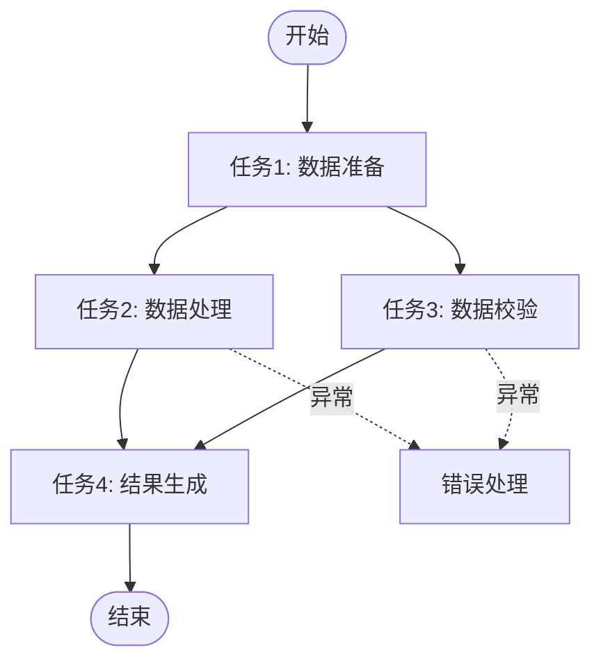
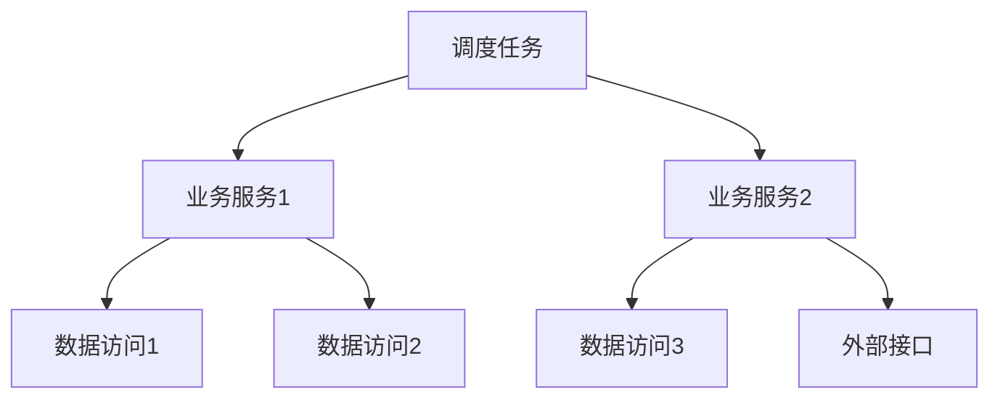

# 输出模板

## 目录

1. [任务清单模板](#任务清单模板)
2. [业务逻辑说明模板](#业务逻辑说明模板)
3. [数据流文档模板](#数据流文档模板)
4. [依赖关系图模板](#依赖关系图模板)
5. [完整报告模板](#完整报告模板)

---

## 任务清单模板

### Markdown 表格格式

```markdown
## 调度任务清单

### 概览

- **项目**: [项目名称]
- **框架类型**: [Quartz/Spring Scheduler/Spring Batch/自研框架]
- **任务总数**: [数量]
- **分析日期**: [日期]

### 任务列表

| 序号 | 任务名称 | 业务域 | 触发方式 | 核心操作 | 依赖服务 | 数据表 |
|-----|---------|--------|---------|---------|---------|--------|
| 1 | [TaskName] | [Domain] | [Trigger] | [Operations] | [Services] | [Tables] |
| 2 | ... | ... | ... | ... | ... | ... |

### 按业务域分类

#### [业务域1]

| 任务名称 | 功能描述 | 触发条件 |
|---------|---------|---------|
| [Name] | [Desc] | [Trigger] |

#### [业务域2]

...

### 触发方式统计

| 触发类型 | 数量 | 任务列表 |
|---------|------|---------|
| Cron表达式 | [N] | [Task1, Task2...] |
| 固定间隔 | [N] | [Task3, Task4...] |
| 事件触发 | [N] | [Task5...] |
```

### JSON 格式

```json
{
  "project": "项目名称",
  "framework": "框架类型",
  "totalTasks": 100,
  "analysisDate": "2024-01-01",
  "tasks": [
    {
      "id": 1,
      "name": "TaskName",
      "className": "com.example.TaskClass",
      "businessDomain": "业务域",
      "trigger": {
        "type": "cron",
        "expression": "0 0 1 * * ?",
        "description": "每日凌晨1点"
      },
      "operations": ["数据查询", "计算", "更新"],
      "dependencies": {
        "services": ["Service1", "Service2"],
        "repositories": ["Repo1", "Repo2"],
        "externalApis": ["Api1"]
      },
      "dataTables": ["table1", "table2"],
      "inputParams": ["param1", "param2"],
      "outputResult": "结果描述"
    }
  ]
}
```

---

## 业务逻辑说明模板

### 单个任务详细说明

```markdown
## 任务: [任务名称]

### 基本信息

- **类名**: [完整类名]
- **所在包**: [包路径]
- **业务域**: [业务域分类]
- **任务类型**: [数据同步/计算处理/数据维护/通知告警/控制协调]

### 触发配置

- **触发方式**: [Cron/固定间隔/事件驱动]
- **触发条件**: [具体配置]
- **执行环境**: [生产/测试/开发]

### 输入参数

| 参数名 | 类型 | 来源 | 说明 |
|--------|------|------|------|
| [param1] | String | 上下文 | [说明] |
| [param2] | Integer | 配置 | [说明] |

### 业务逻辑

#### 主要步骤

1. **[步骤1名称]**
   - 操作: [具体操作]
   - 输入: [输入数据]
   - 输出: [输出数据]
   - 依赖: [依赖服务/表]

2. **[步骤2名称]**
   - 操作: [具体操作]
   - 业务规则: [规则说明]
   - 异常处理: [处理方式]

3. **[步骤3名称]**
   - ...

#### 核心业务规则

- [规则1]: [详细说明]
- [规则2]: [详细说明]

### 数据操作

#### 读取的数据表

| 表名 | 操作类型 | 业务用途 |
|------|---------|---------|
| [table1] | SELECT | [用途] |
| [table2] | SELECT | [用途] |

#### 写入的数据表

| 表名 | 操作类型 | 业务用途 |
|------|---------|---------|
| [table3] | INSERT/UPDATE | [用途] |

### 外部依赖

#### 内部服务

| 服务名 | 调用方法 | 用途 |
|--------|---------|------|
| [Service1] | [method] | [用途] |

#### 外部接口

| 接口名 | 调用方式 | 用途 |
|--------|---------|------|
| [Api1] | HTTP/RPC | [用途] |

### 输出结果

- **成功结果**: [描述]
- **失败结果**: [描述]
- **结果格式**: [JSON/对象/状态码]

### 异常处理

| 异常类型 | 处理方式 | 影响 |
|---------|---------|------|
| [异常1] | [处理] | [影响] |
| [异常2] | [处理] | [影响] |

### 注意事项

- [注意点1]
- [注意点2]
```

---

## 数据流文档模板

### 数据流说明

```markdown
## 数据流: [数据流名称]

### 概览

- **起点**: [数据源]
- **终点**: [数据目标]
- **涉及任务**: [任务列表]
- **数据量**: [量级描述]

### 数据流转图


### 详细步骤

#### 步骤1: [任务1名称]

- **输入**: [输入数据描述]
- **转换逻辑**: [处理逻辑]
- **输出**: [输出数据描述]
- **字段映射**:
  | 源字段 | 目标字段 | 转换规则 |
  |--------|---------|---------|
  | [field1] | [field2] | [规则] |

#### 步骤2: [任务2名称]

...

### 数据字段说明

#### 输入字段

| 字段名 | 类型 | 说明 | 示例 |
|--------|------|------|------|
| [field] | [type] | [desc] | [example] |

#### 输出字段

| 字段名 | 类型 | 说明 | 示例 |
|--------|------|------|------|
| [field] | [type] | [desc] | [example] |

### 数据质量检查

- [检查点1]: [说明]
- [检查点2]: [说明]
```

---

## 依赖关系图模板

### 任务依赖图

```markdown
## 任务依赖关系

### 整体依赖图



### 依赖矩阵

| 任务 | 依赖任务 | 依赖类型 | 说明 |
|------|---------|---------|------|
| [Task2] | [Task1] | 数据依赖 | [说明] |
| [Task4] | [Task2] | 时序依赖 | [说明] |

### 关键路径

[Task1] → [Task2] → [Task4] → [结束]

- **预计耗时**: [时间]
- **关键任务**: [任务列表]
```

### 服务依赖图

```markdown
## 服务依赖关系


```

---

## 完整报告模板

```markdown
# 调度系统分析报告

## 1. 执行摘要

### 1.1 项目概况

- **系统名称**: [名称]
- **分析范围**: [范围]
- **分析时间**: [时间]
- **调度框架**: [框架]

### 1.2 关键发现

- 任务总数: [数量]
- 业务域数量: [数量]
- 核心数据表: [数量]
- 外部依赖: [数量]

### 1.3 风险提示

- [风险1]: [说明]
- [风险2]: [说明]

## 2. 系统架构

### 2.1 架构概览

[架构图]

### 2.2 技术栈

- 调度框架: [框架]
- 开发语言: [语言]
- 数据库: [数据库]
- 其他组件: [组件]

## 3. 任务清单

[任务清单表格]

## 4. 业务域分析

### 4.1 [业务域1]

#### 业务描述

[描述]

#### 涉及任务

[任务列表]

#### 数据流

[数据流图]

### 4.2 [业务域2]

...

## 5. 数据流分析

### 5.1 主要数据流

[数据流列表]

### 5.2 数据表清单

| 表名 | 用途 | 读写任务 |
|------|------|---------|
| [table] | [用途] | [任务列表] |

## 6. 依赖关系

### 6.1 任务依赖

[依赖图]

### 6.2 服务依赖

[依赖图]

## 7. 问题与建议

### 7.1 发现的问题

| 问题 | 影响 | 建议 |
|------|------|------|
| [问题] | [影响] | [建议] |

### 7.2 优化建议

- [建议1]
- [建议2]

## 8. 附录

### 8.1 术语表

| 术语 | 说明 |
|------|------|
| [术语] | [说明] |

### 8.2 参考资料

- [资料1]
- [资料2]

### 8.3 变更记录

| 日期 | 版本 | 变更内容 |
|------|------|---------|
| [日期] | [版本] | [内容] |
```

---

## 使用建议

1. **任务清单**: 适合快速了解系统全貌
2. **业务逻辑说明**: 适合深入理解单个任务
3. **数据流文档**: 适合理解数据流转
4. **依赖关系图**: 适合分析任务间关系
5. **完整报告**: 适合项目文档和知识沉淀

根据实际需求选择合适模板，也可以组合使用多个模板。
